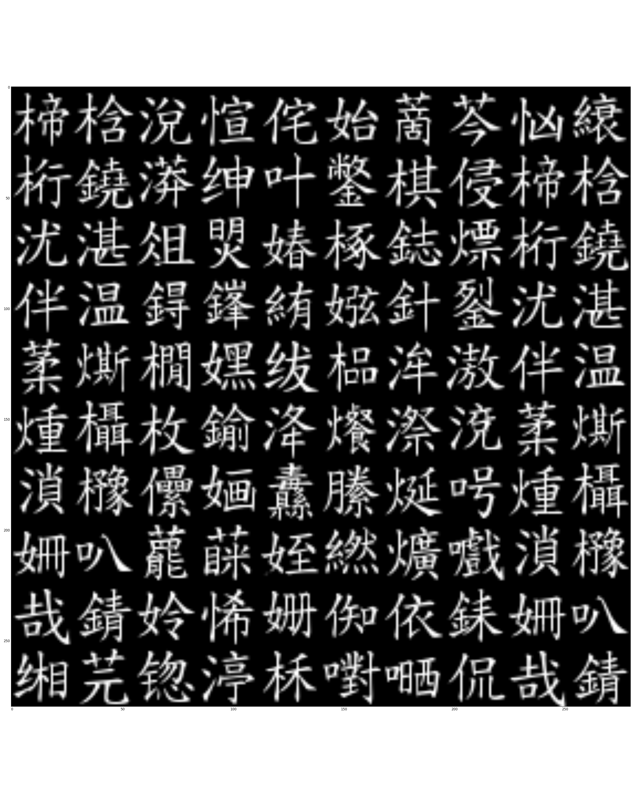

# VAE for Hanzi (漢字) Analysis.
This project is simply for fun. 
I was curious what a VAE would learn from the complete set of 
Hanzis (about 30k characters).
The training set can be easily obtained from *.ttf.
The results were not unexpected: VAE learned a space where the 
only most common ingredients (Bushou, 部首) resided.

However, VAE was unable to reconstruct other ingredients.
It was pretty disappointing but expected (based on statistics).

### The Latent Space


### Reconstruction

Input a character, the VAE only outputs the 

### Reference Input



## Dependency
Python 2.7
1. Scipy (conda install scipy)
2. Matplotlib
3. PIL (conda install PIL)

## Usage
```bash
python vae.py
```
